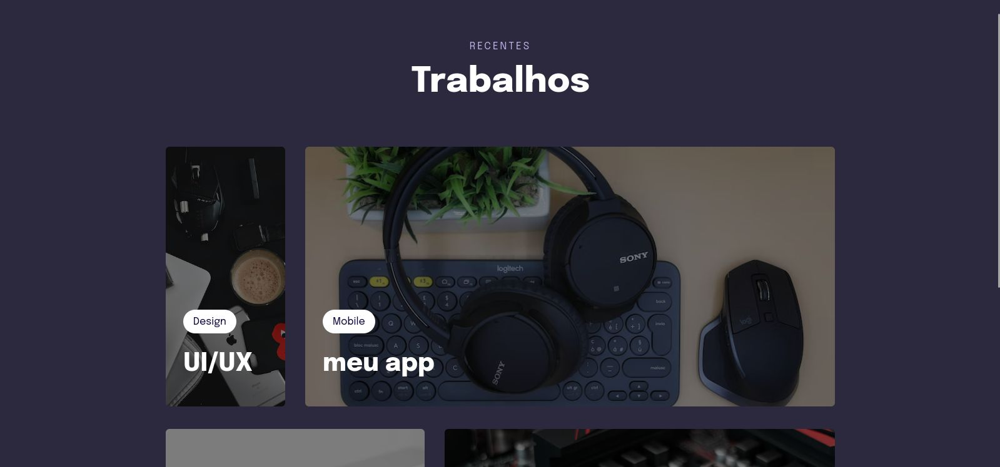
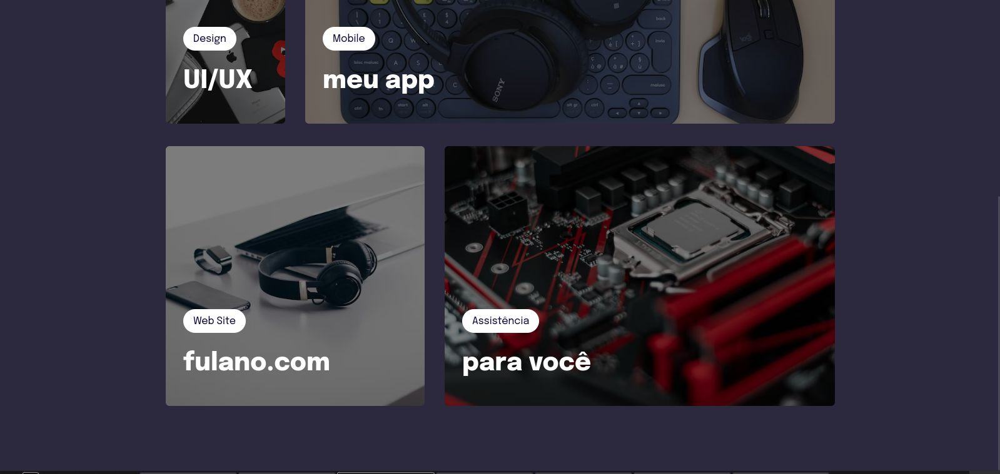
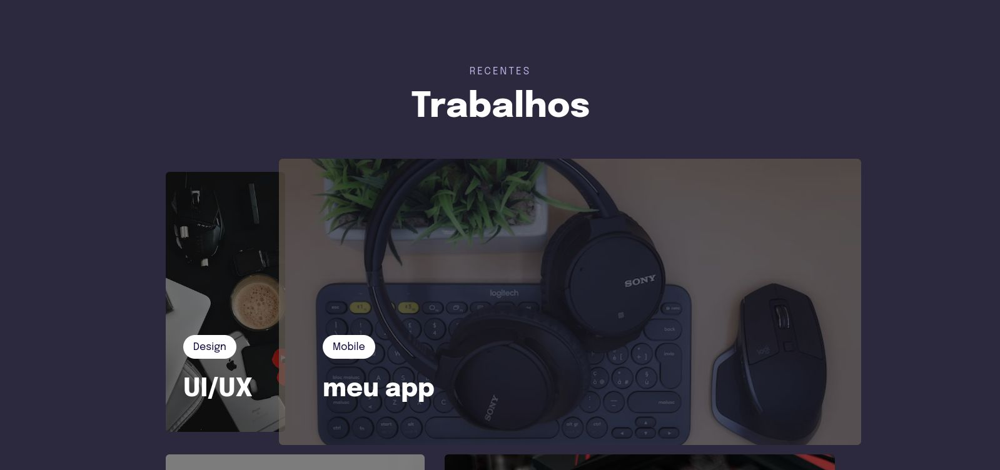
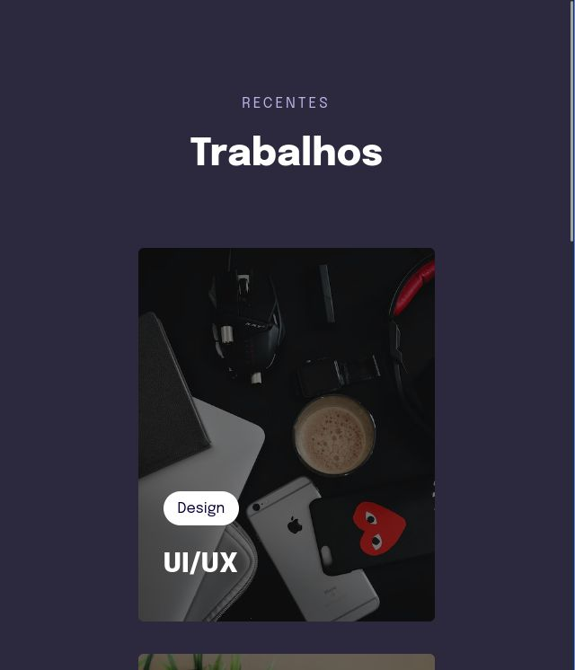
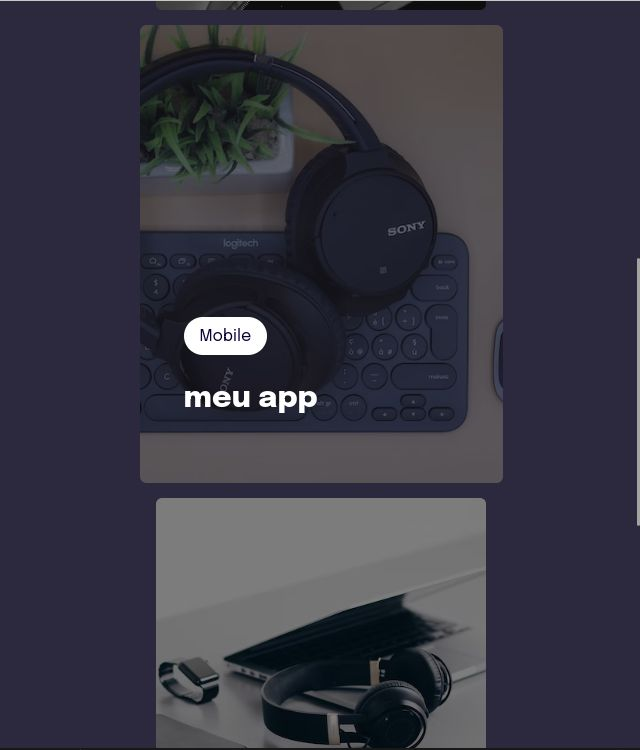

<h1 align="center"> Trabalhos recentes(animações com responsividade) </h1>

 

## 🚀 Tecnologias

Esse projeto foi desenvolvido com as seguintes tecnologias:

- HTML e CSS

 

 
<h3 align="center">Tela do projeto em Desktop</h3>

 
  

 

 
<h3 align="center">Tela do projeto em Desktop</h3>

 
  

 

 
<h3 align="center">Tela do projeto em Desktop - Com animação</h3>

 
  

 

 
<h3 align="center">Tela do projeto para mobile </h3>

 
  

 

 
<h3 align="center">Tela do projeto para mobile - com animação</h3>

 
  

 

## 💻 Projeto

O projeto foi desenvolvido no curso **Explorer** da **Rocketseat** e tem como objetivo treinar as tecnologias utilizadas.
